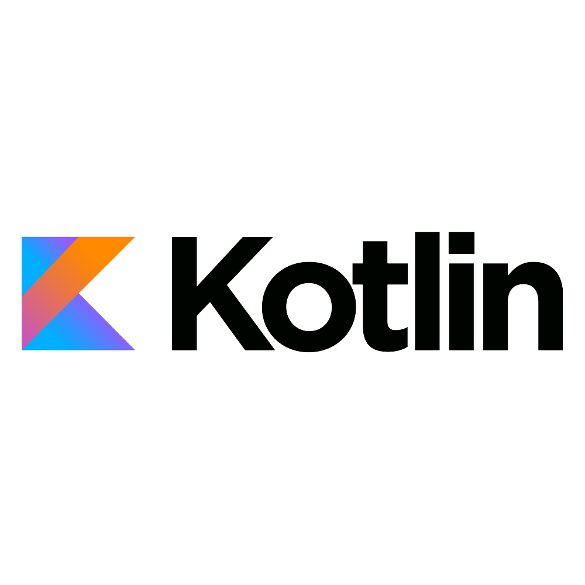
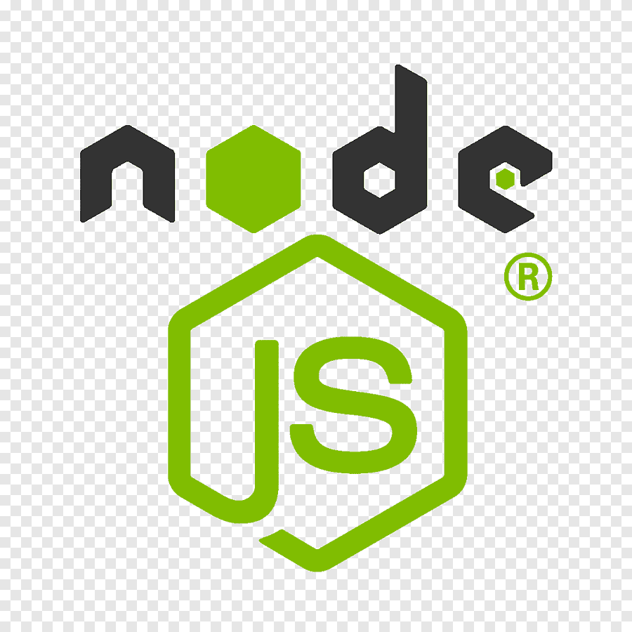
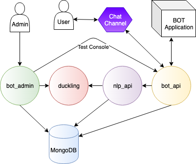

# Developing bots with Tock

_Tock Studio_ allows you to build conversational paths (or _stories_) including text, buttons, images,
carousels, etc. To go further, it is possible to program paths
in [Kotlin](https://kotlinlang.org/), [Javascript](https://nodejs.org/), [Python](https://www.python.org/)
or other languages.

{style="width:75px;"}

{style="width:75px;"}

{style="width:75px;"}

{style="width:75px;"}

Two modes / frameworks / architectures are proposed:

## The *Bot API* mode

The _Tock Bot API_ mode (recommended for most cases) allows you to develop in [Kotlin](https://kotlinlang.org/)
or other languages ​​with the clients provided for [Javascript/Nodejs](https://nodejs.org/) and
[Python](https://www.python.org/) or any language using the Tock API:

This mode is the only one available on the [Tock demo platform](https://demo.tock.ai/).
It is also the only mode that allows you to develop in any programming language, via the API.

For more information, see the [_Bot API_](../bot-api) page.

## The *Integrated Bot* mode

In this mode, you can access all the features and possibilities of the Tock framework to develop a bot.

> This is the historical development mode of Tock, and currently most of the bots published by Tock designers.
are developed in this way.

Setting up the solution is more complex than the _Bot API_ mode and requires in particular that the bot component
accesses the MongoDB database directly. It is therefore necessary to use this mode:

- To install a platform (usually with [Docker](https://www.docker.com/)) on your workstation or on a server
- To share the connection to the MongoDB database between the development workstations and the other components
of the Tock platform used
- To master the programming language [Kotlin](https://kotlinlang.org/)

For more information, see the page [_Bot intégré_](../bot-integre).