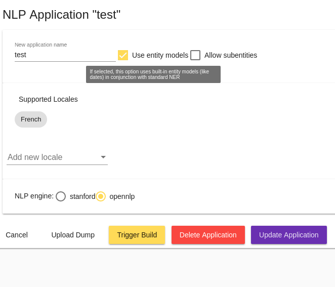

# The *Settings* menu

The _Settings_ menu allows you to create and configure Tock conversational applications (i.e.
models / bots that can coexist on a platform). Several administration and configuration functions for
bots are also available via this menu: import/export a configuration, configure the language, connectors, etc.

## The *Applications* tab

This screen allows you to create, modify, delete Tock conversational applications.

> When you first connect to the [demo platform](https://demo.tock.ai/),
>a simplified wizard allows you to create the first application (the first bot). You can then go through
>this screen to add other applications.

### Create an application

To add an application, click on _Create New Application_ :

* Enter a name / identifier for the application

* Choose whether the template can include _entities_ or even _sub-entities_ (see [Concepts](../../concepts) for more information)

* Select one or more languages ​​(see [Building a multilingual bot](../../guides/i18n) for more information)

* Select an NLU engine ([Apache OpenNLP](https://opennlp.apache.org/) or [Stanford CoreNLP](https://stanfordnlp.github.io/CoreNLP/),
see [Installation](../../../admin/installation) for more information)

### Edit, import and export an application

For each application already created, you can then:

* _Download an application dump_ : download its configuration in JSON format: language, intent/entity model, etc.

* _Download a sentences dump_: download its qualified sentences in JSON format

* _Edit_: modify the application configuration
* A form allows you to modify the initial configuration
* An _Advanced options_ section adds other parameters for advanced users:
* _Upload dump_: load a configuration or qualified sentences from a file in JSON format.
 Only new intents/phrases will be added, this function does not modify/delete existing intents/phrases
* _Trigger build_: trigger/force model rebuild
* _NLU Engine configuration_: fine-tune the underlying NLU engine (parameters depend on the engine
used, [Apache OpenNLP](https://opennlp.apache.org/) or [Stanford CoreNLP](https://stanfordnlp.github.io/CoreNLP/))
* _Alexa Export_: export the Tock model in a format usable by [Alexa](https://alexa.amazon.com/)

The _Upload dump_ function (see above) is also directly accessible at the bottom of the screen, allowing:

* Either to modify an application (if the `application name` exists)
* Either create/import a new one

## The *Configurations* tab

This screen allows you to access the _connectors_ of a bot, to add, modify or delete them. This is also where you find
the information to connect programmatically.

### Connect programmatically to the bot

The settings to connect to the bot programmatically (ie. via a program / programming language)
are found in this screen:

* The _API Key_ can be copied and embedded in the client code of the _Bot API_ to connect programmed paths
in Kotlin or in another programming language like Javascript/Nodejs or Python

* An address / URL can be configured to use the _WebHook_ mode of _Bot API_

To learn more about these settings and path development, see [Bot API](../../../dev/bot-api).

### Manage connectors

The list of _connectors_ of the bot is displayed under the API key. To add a connector to the bot, click on
_Create a new Configuration_.

All connectors have the following configuration:

* _Configuration name_ : the name/identifier of the bot
* _Connector type_ : the channel type (e.g. Messenger, Slack, etc.)
* _Connector identifier_ : an identifier for the connector, unique for the bot
* _Relative REST path_ : a relative path unique for the platform, to communicate with the bot on this channel.

> By default, the path is of the form `/io/{organisation}/{application}/{channel}` which makes it unique on the platform

(unless two connectors of the same type are declared for the same bot).

Each connector also has an additional configuration specific to this connector type. These settings

are in _Connector Custom Configuration_. These specific settings are documented with each connector/channel type,
see [Connectors](../../guides/channels).

### Test connectors

For each connector added to the bot, a _test connector_ is also created and configured. It is used to "simulate" the connector
when testing the bot directly in the _Tock Studio_ interface (menu _Test_ > _Test the bot_).

By default, test connectors are not displayed in the _Bot Configurations_ screen. Click on _Display test
configurations_ to view them and possibly modify them.

> In particular, if you get connection error messages in the _Test the bot_ page, do not hesitate to
>check the test configuration, in particular the _Application base url_ address (for a platform deployed with Docker
>Compose by default, it should be `http://bot_api:8080` with the container name and port declared
>in the `docker-compose-bot.yml` descriptor).

## The *Namespaces* tab

This screen allows you to manage one or more namespaces or _namespaces_. Each application, each bot is created
within a namespace. It is possible to manage several namespaces, and to share some of them with
a team or other Tock Studio users. To do this, simply edit the namespace and add other
users (giving them more or less rights on the namespace).

## The *Log* tab

This view allows you to track the main application configuration changes made
by users via Tock Studio: application creation, connector modifications, imports, etc.

## Continue...

Go to [Menu _FAQ Training_](../faq-training) for the rest of the user manual.

> You can also go directly to the next chapter: [Development](../../../dev/modes.md).