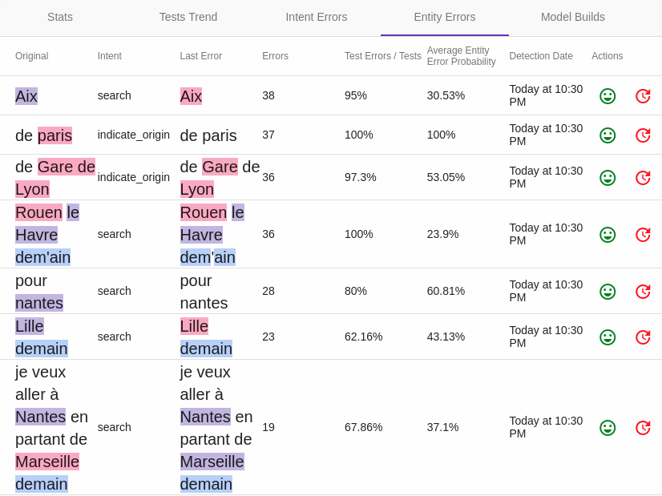

# The _Model Quality_ menu

The _Model Quality_ (or _NLU QA_) menu allows you to evaluate and monitor over time the quality/relevance/performance of conversational models.

## The _Model Stats_ tab

This screen presents graphs to track the evolution of several indicators of the quality of the conversational model:

* **Relevance**: the scores of the detection algorithms on intentions (_Intent average probability_)
and on entities (_Entity average probability_)

* **Traffic / errors**: the number of requests to the model (_Calls_) and the number of errors (_Errors_)

* **Performance**: the response time of the model (_Average call duration_)

## The _Intent Distance_ tab

The metrics presented in the table on this page (_Occurrences_ and _Average Diff_) allow you to identify intentions that are
more or less close in the model, in particular to optimize the modeling.

## The _Model Builds_ tab

This screen presents statistics on the latest reconstructions of the model. These are therefore indications on
the performance of the model.

## The _Tests Trends_ tab

The _Partial model tests_ are a classic way to detect qualification errors,
or problems of proximity of intentions (or entities) between them.

> This involves taking a part of the current model at random (for example 90% of the sentences of the model) in order to build
> a slightly less relevant model, then testing the remaining 10% with this new model.
>
> The principle established, all that remains is to repeat the process a certain number of times
> so that the most frequent errors are presented to a manual corrector.
>
> Note that these tests are only useful with already substantial models.

This tab shows the evolution of the relevance of the partial model tests.

> By default, the tests are scheduled to be launched from midnight to 5am, every 10 minutes.
> It is possible to configure this behavior with the `tock_test_model_timeframe` property (default: `0.5`).

## The _Test Intent Errors_ tab

This screen shows the results of the _partial tests_ of intent detection (see above), with the details of the
phrases/expressions recognized differently from the real model.

In this example, no "real" error was detected. However, we can see that in some cases the model
is systematically wrong, with a high probability.

For each sentence, it is possible via the _Actions_ column to confirm that the basic model is correct (with
_Validate Intent_) or to correct the detected error (_Change The Intent_).

> It is interesting to periodically analyze these differences, some differences being well explained, even being
>sometimes "assumed" (false negatives), others can reveal a problem in the model.

## The _Test Entity Errors_ tab

Like _Intent Test Errors_ for entities, this screen presents the results of _partial tests_ for entity detection.

> It is interesting to periodically analyze these differences, some differences being well explained, even being
>sometimes "assumed" (false negatives), others can reveal a problem in the model.

## Continue...

Go to [Menu _Settings_](../configuration) for the rest of the user manual.

> You can also go directly to the next chapter: [Development](../../../dev/modes).
